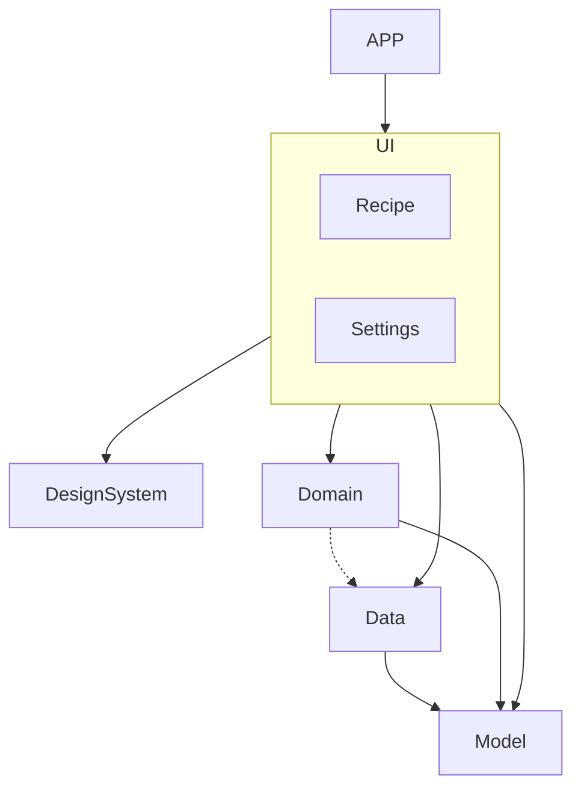

# MyRecipes Android App
## Architecture and Design Decisions
## Overview
The architecture of this Android app follows Clean Architecture principles combined with the MVVM (Model-View-ViewModel) pattern, leveraging Jetpack Compose for UI development. The structure is organized into four main layers: Model, Data, Domain, and UI. Additionally, a designSystem module has been created to manage reusable UI components and theming. Dependency Injection (DI) is handled using Hilt to ensure that dependencies are provided and managed efficiently.

Adhering to these principles ensures a clear separation of concerns, high testability, and maintainability, facilitating easier collaboration and scalability as the application evolves.

## Layers and Their Responsibilities
### Model Layer:
**Purpose:** Define the core data structures (entities) that represent the application’s data. 

**Components:** 
* Entities: Data classes that model the key entities of the application.
* Repository Interfaces: Define the contract for data operations that the Data layer must implement.
 
**Design Decision:** By defining entities in a separate layer, the application ensures that these data structures are not tied to any specific data source or business logic, promoting reusability and consistency across different layers.

### Data Layer:
**Purpose:** Handle data operations, including accessing remote APIs and local databases.

**Components:**
* Repositories: Implement the data access logic defined by repository interfaces in the Model layer.
* Data Sources: Include Retrofit services for remote API calls. Also Room DAOs and SharePreferences implementation for local database operations.
* Mappers: Convert raw data from data sources to application entities and vice versa.

**Design Decision:** This layer implements the repository interfaces defined in the Model layer. This abstraction makes it easy to swap out data sources.

### Domain Layer:

**Purpose:** Encapsulate business logic and application rules.

**Components:**
* Use Cases: Interactors that execute specific pieces of business logic, each typically performing one action.

**Design Decision:** repository instances are provided via dependency injection, ensuring they can fetch or manipulate data as needed. This separation ensures the Domain layer is independent of any framework or data source, enhancing testability and maintainability.

### UI Layer:

**Purpose:** Manage user interface and user interactions.

**Components:**

* ViewModels: Handle UI-related data and business logic interaction, exposed as state for the UI to observe.
* Composables: Define the UI components using Jetpack Compose.
* Screens: Composables that represent different screens of the app, structured to observe and react to the state changes from ViewModels.

**Design Decision:** The UI layer uses the MVVM pattern where ViewModels interact with Use Cases to fetch or manipulate data and then expose this data to the UI via StateFlow. Jetpack Compose is used to build the UI declaratively, making the UI code more flexible and concise.

### DesignSystem Module:

**Purpose:** Provide a consistent and reusable set of UI components and manage theming.

**Components:**

* Custom Composables: Predefined UI components like buttons, text fields, and other common widgets.
* Theme Definitions: Color schemes, typography, shapes, and other theming aspects.
* Design Decision: Centralizing the design system promotes consistency across the app and allows easy adjustments to the app's look and feel. It also helps in maintaining a cohesive design language and improves the maintainability of the UI code.
